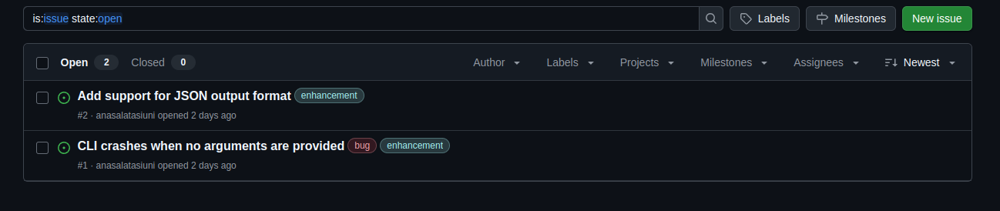

# GitHub Issue Tagger

## Overview

This workflow automates triage for GitHub issues: it fetches open issues, generates concise summaries, classifies them using available repository labels, and applies those labels back to the issues.

## How It Works

1. **User Input**: Provide `repo_owner`, `repo_name`, and optionally `max_issues` (default: 20).
2. **Fetch Issues**: Retrieves open issues from the repository.
3. **Fetch Labels**: Gets all available labels in the repo.
4. **Summarize Issues**: Uses an LLM to generate a short summary for each issue.
5. **Classify Issues**: Suggests relevant labels for each summary.
6. **Apply Labels**: Posts the suggested labels back to GitHub for each issue.

## Input

### Required
- `repo_owner`: Owner/organization of the GitHub repository
- `repo_name`: Name of the GitHub repository

### Optional
- `max_issues`: Maximum number of issues to process (default: 20)

## Output
- Applied suggested labels for open issues automaticlly.
    
    Check the [repository](https://github.com/anasalatasiuni/Julep-Github-Issue-Tagger/issues)
## Future Work

1. **Use Secrets**: When `Julep Secrets` is available we can use it for GitHub API key.
2. **Enhanced Label Matching**: Improve accuracy of label suggestions.
3. **More Customization**: Allow users to configure summary length and other variables that can affect the proccess.
4. **Label Creation**: Automatically create new labels if needed
5. **Label Management**: If the issue has a label already, allow the user to decide if we append labels or delete old labels.

## How to Use

1. **Configuration**
    - Set your `JULEP_API_KEY` 
    - Set your GitHub token in the workflow code where indicated.

3. **Run the Workflow**
   - Provide the required inputs: `repo_owner`, `repo_name`, and optionally `max_issues`.
   - Run the workflow.
   - The workflow will classify the issues and apply labels automatically.

4. **Check Results**
   - Check your GitHub repository's issues and labels.